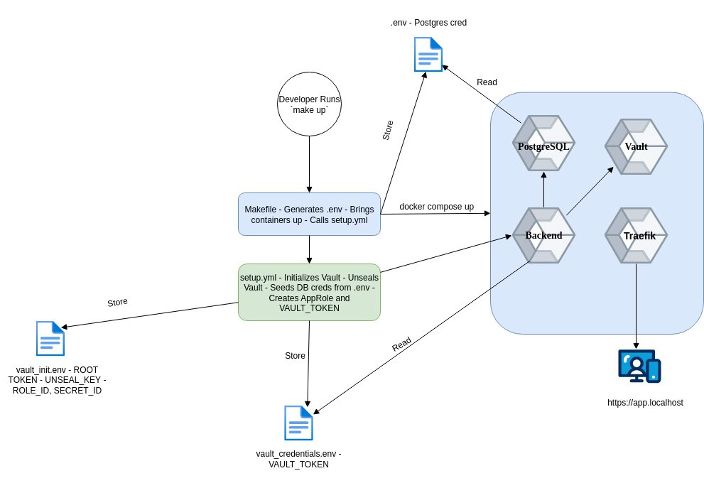

# 💼 Senior DevOps Challenge Documentation

## 📌 Project Overview

* **PostgreSQL** for persistent storage
* **TypeScript backend** with CRUD API
* **Vault** for dynamic secret management
* **Traefik** as a reverse proxy and TLS terminator

---

## 🧱 System Architecture

**Components:**

* **Backend** container (TypeScript API)
* **PostgreSQL** container
* **Vault** (development mode for local setup)
* **Traefik** (HTTPS reverse proxy)

📌 All secrets are retrieved dynamically at runtime.


### 🔐 Architecture Diagram — Vault Secrets Flow




---

## 📁 Project Structure

```sh
project/
├── docker-compose.yml
├── Makefile
├── setup.yml                  # Ansible playbook
├── app/
│   └── backend/
│       └── ...                # backend application code
│   └── vault_credentials.env  # <-- This file will be created by Ansible for the VAULT_TOKEN
│   └── vault_init.env         # <-- This file will be created by Ansible for the Vault root token, role_id and secret_id
├── backend.Dockerfile         # Dockerfile for backend service
├── traefik/
│   ├── dynamic_conf.yml       # traefik config
│   └── certs/                 # self-signed tls
```

---

## 🚀 Setup Instructions

### 1. Prerequisites

* Docker Desktop or Docker Engine & Compose
* Ansible (`brew install ansible` on MacOS)
* `make` CLI tool

---

### 2. Commands

#### Start System

Starts all services, configures Vault, injects secrets, and boots the backend.

```bash
make up
```

#### Shut Down

Stops and removes all containers, networks, and volumes.
```bash
make down
```
#### Check Logs

To check the logs of the running containers.
```bash
make logs
```

#### Run Health Check

Sends request to `https://app.localhost/api/health`
```bash
make test
```

---

## 🧠 Design Decisions

These are the design decisions based on project requirement:

* **Vault dev mode** chosen for simplicity and local setup but would use integrated storage + TLS in production.
* Traefik handles all routing with HTTPS termination using self-signed TLS (local).
* Explicit `.env` files are generated and ignored from Git to avoid credential exposure.
* `depends_on` is set in docker compose to make sure the order of container deployment is correctly followed
* `Makefile` starts backend container last to make sure that Vault is correctly configured with Postgres secret
* Environment variables are set in containers through env_files to prevent hardcoding values
* `POSTGRES_PASSWORD` value is randomly generated and saved in `.env` file through `Makefile`


More detail can be found in Appendix section
---

## 🔐 Security Considerations

1. All Docker images use explicitly pinned versions to prevent unexpected changes due to upstream updates.

2. Traefik is configured to use HTTPS for secure communication with the backend. For local development, self-signed certificates are used but use of Let's encrypt or simmilar technologies is recommended

3. Only HTTPS port for Traefik is exposed to the host. This serves as the single secure entry point for the application.

4. PostgreSQL credentials are randomly generated during setup and never hardcoded or committed to the Git

5. Used Least Privilege Policy that grants the backend service only read access to the secret/data/database path.

6. All services (PostgreSQL, Vault, Backend, Traefik) are deployed within a dedicated Docker internal bridge network.

7. PostgreSQL port 5432 is only exposed internally to the internal Docker network. It is not directly exposed to the host machine or external networks, preventing direct external database access. 

8. The backend service itself does not directly expose any ports to the host machine. All external traffic is routed through Traefik.

9. Vault port 8200 is exposed to the host for Ansible to interact with it during setup and for manual inspection.

10. This is a local development setup but it's recommended to use TLS for Vault.

---

## ⚙️ Automation Details

### `make up` Summary

This `make up` command does the following:

1. Adds 127.0.0.1 app.localhost to /etc/hosts (for TLS routing).
2. Generates .env with POSTGRES_USER, POSTGRES_PASSWORD, and POSTGRES_DB if not already present.
3. Starts Vault, PostgreSQL, and Traefik containers.
4. Executes the setup.yml Ansible playbook.
5. Initializes Vault and unseals it
6. Seeds DB credentials to Vault
7. Creates a policy and AppRole
8. Authenticates and writes AppRole token to vault_credentials.env
9. Starts the backend service, which retrieves credentials securely from Vault.
10. You can verify everything is working with make test or by accessing https://app.localhost/api/health.

### `setup.yml` Summary

This playbook does the following:

1. Initializes and unseals Vault (if not already initialized)
2. Enables KV secrets engine
3. Seeds database credentials
4. Defines a read-only policy for `secret/data/database`
5. Enables and configures AppRole
6. Retrieves Role ID & Secret ID
7. Authenticates using AppRole and writes resulting Vault token to `vault_credentials.env`

> Vault is now ready to securely serve secrets to backend via AppRole authentication.

---

## 📎 Appendix

### Default Environment Variables (used during setup)

Use the following credentials for the Postgres:

```
POSTGRES_USER=backend_user
POSTGRES_DB=devops_challenge
```

The URL for the app is `app.localhost`

The value used for VAULT_TOKEN will saved in `vault_credentials.env` file